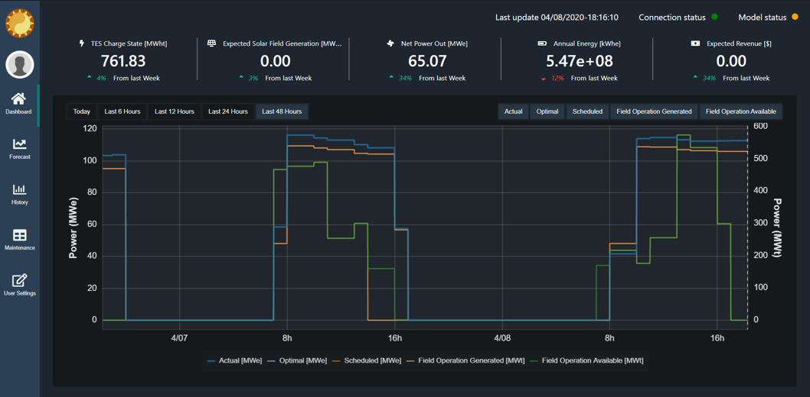
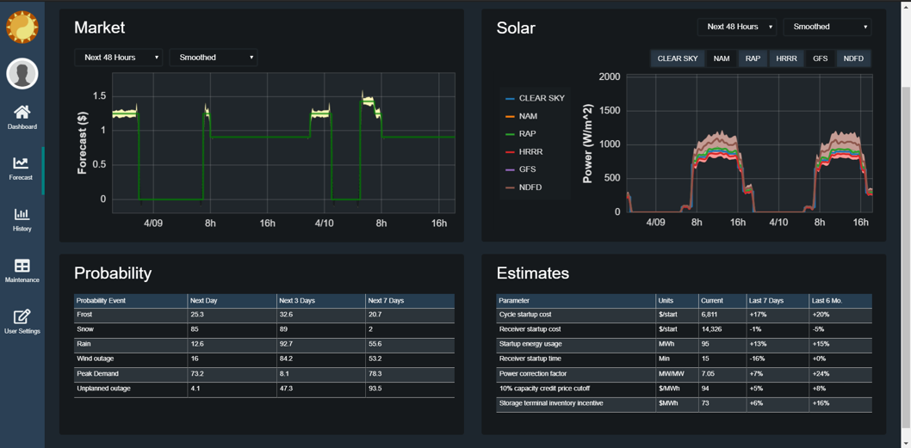
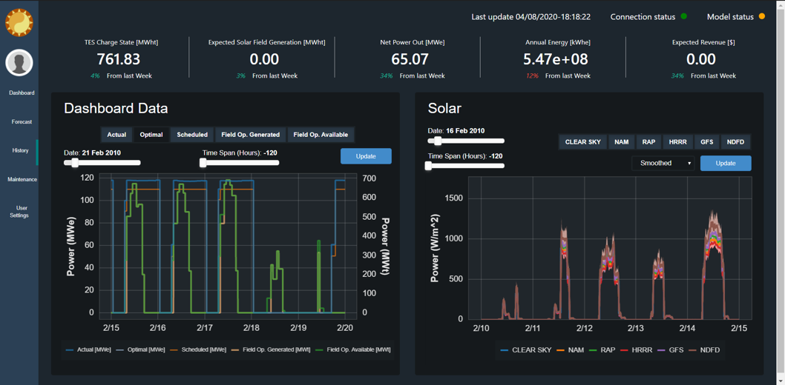

# Dashboard Plots

The Dashboard stack currently uses Django and Bokeh both running on a server (mentioned in the previous readme). These will both be run on production mode once on the server locally at the plant.

The top of the Dashboard will be the same displayed on the Dashboard, Forecast, and History Tabs. The top displays information which will update on the minute once we are streaming information. The 5 values indicate TES Charge State, Expected Solar Field Generation, Net Power OUt, Anual Energy and Expected revenue. The percentage values will represent the percent above or below their optimal amounts.

In the very top right of all pages there are indicators for the statuses of the Connection and the Model as well as the current time and date.

## Dashboard Home

_Dashboard Plot_

The Dashboad shows the current information for the plant. It will show the Actual, Optimal, Scheduled, Field Operation Generated and Available values for the current daily window as well as the last 6, 12, 24, and 48 hour windows. The radio buttons on the top left will allow for the selection of a window, and the select buttons on the top right allow for multiple plots to be shown at the same time with the two axes denoted on the left and right, with the legend below denoting which axes apply to which plots.

## Forecasts

_Forecasts Plots & Tables_

The Forecast tab will allow for the user to see the Market and Solar forecast data. Both plots have dropdowns for the window of time which will again come in 6, 12, 24, and 48 hour time blocks. The difference between these and the Dashboard plot time windows is that the windows are in the future from the current time.

The Probability and Estimates tables below provide information on weather predictions and startup and usage information for the current day, past week, and last 6 months.

## History

_History Plots_

The history plots show the same data from the dashboard and solar plots, except these plots have sliders. The two sliders on bot plots allow for the user to change the date and the time window. The time window goes from -120 to 120 hours (&#177; 5 days).
